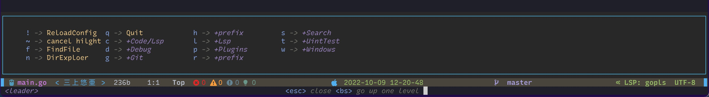
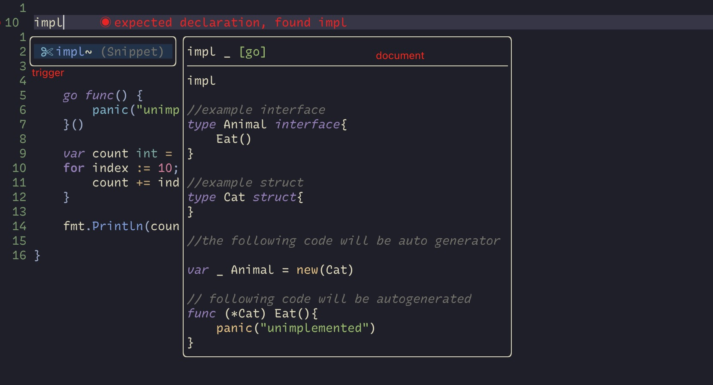
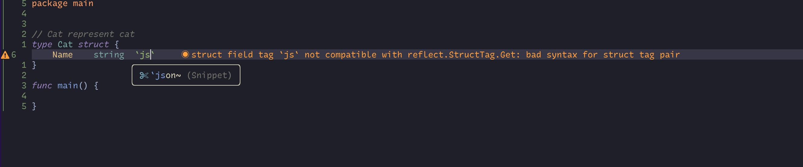
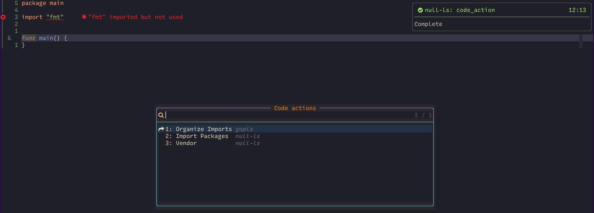
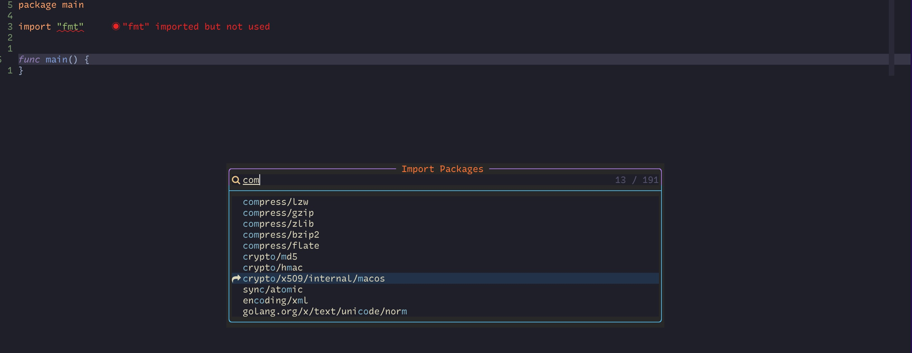
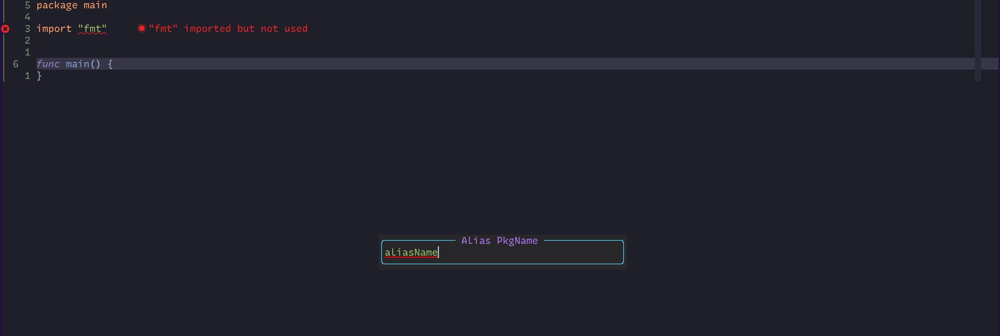
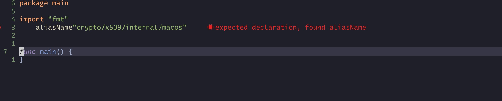
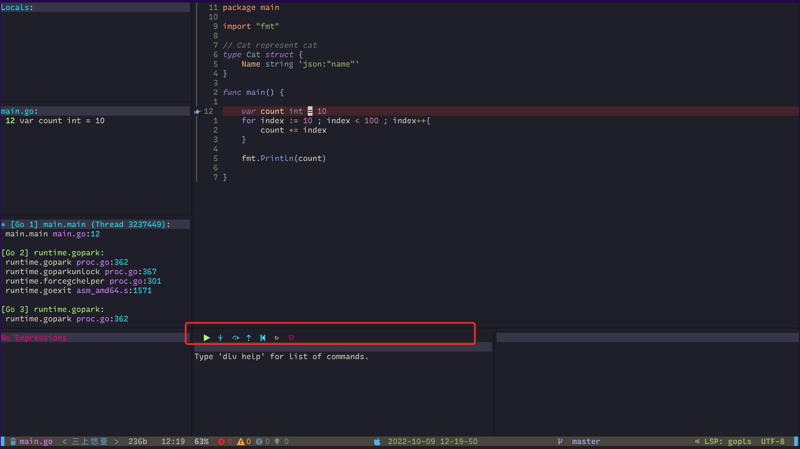
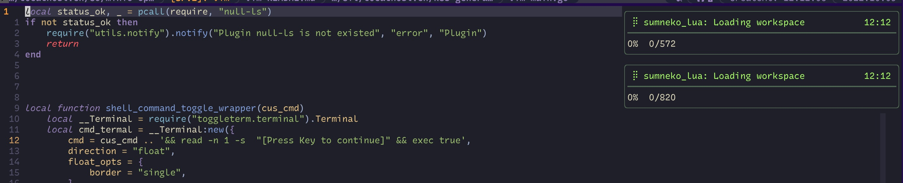

#### Introduct
&emsp; nvim ide for golang, 主要针对`go`语言做了一些优化.当然也可以用作`c/c++`,`python`,`rust`等语言的IDE.


#### 安装
&emsp;首先您需要先安装nvim(建议neovim版本0.7以上版本)
*下载fucknvim*
```bash
$ git clone https://github.com/3Xpl0it3r/gonvim.git
```

*建议备份原始nvim配置文件*
```bash
cp -rf ~/.conf/nvim  ${HOME}/.conf/nvim_back
```

*安装nvim配置文件*
> 安装过程最好打开科学上网
```bash
# 安装
$ ln -sv gonvim ~/.conf/nvim
$ nvim
```

&emsp;插件安装失败处理
```bash
# 手动安装packer
$ git clone --depth 1 https://github.com/wbthomason/packer.nvim\\n ~/.local/share/nvim/site/pack/packer/start/packer.nvim
# 同步插件
$ nvim +PackerSync
```

*安装gopks*
&emsp;如果您可能会涉及到go语言,强烈建议您安装下gopks(codeaction里面import导入package路径会用到这个工具)
```bash 
go get github.com/3Xpl0it3r/gopkgs
```

##### 快捷键
&emsp; leader键为空格键



#### Snippet支持功能
*补全输入两个字母就会自动触发,因此您不需要输入完整的trigger信息*
##### 所有文本补全
- `date`
> 打印当前时间``
- `pwd`
> 打印当前路径
- `.wrap(`
> xxx.wrap(  =>  (xxx)
- `wrap"`
> xxx.wrap" => "xxxx"
- `wrap'`
> xxx.wrap' => 'xxx'
- `wrap{`
> xxxx.wrap{ => {xxxx}
- 'wrap['
> xxxx.wrap[
- `wrap<`
> xxx.wrap< => <xxx>
- `APACHE`
> 打印license信息

##### 针对go文件的补全
> 具体的含义您可以通过预览来查看每个snip生成的代码效果
- `pkgmain` 
- `fmain`
- `typ`
- `typi`
- `typs`
- `methodprt`
- `methodstruct`
- `impl`
- `\`json`
- `\`xml`
- `funcret`
- `funcnil`
- `forrange`
- `forindex`
- `forcondition`
- `fortrue`
- `ifcondition`
- `iferr`
- `ifnil`
- `ifelse`
- `ifdebug`
- `select`
- `switch`
- `gofunc`

*doc example *





#### CodeAction






#### DapUi
&emsp;dapui支持鼠标操作



#### 其他特性

##### notify显示lsp加载进度



