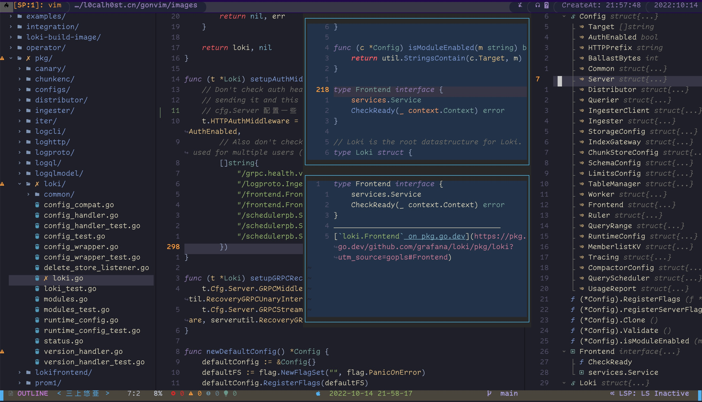

# gonvim


```bash
                                   ____ _____  ____ _   __(_)___ ___ 
                                / __ `/ __ \/ __ \ | / / / __ `__ \
                               / /_/ / /_/ / / / / |/ / / / / / / /
                               \__, /\____/_/ /_/|___/_/_/ /_/ /_/ 
                              /____/                               

```


## Features

gonvim用作goide,针对go做了大量的配置,您可以用来作为您的主力生产工具(目前我用来代替goland,并且体验非常的好).<br>
您也可以用来写cpp/rust/python语言,但是这些语言的体验可能不如成熟IDE(Jetbrain全家桶)那么好.它主要有如下特性<br>

* 代码补全(code complete)
* 集成了`folke/trouble.nvim`来执行代码检查()
* 集成了`tree-sitter`来语法高亮
* 集成Dap来调试代码
* snip代码块自动生成
* 代码格式化(code format use lsp)
* 更流畅的go package补全/ 通过gopls来补全package会有一些问题[issue](https://github.com/golang/go/issues/55873)
* 基于文件名称检索
* 基于内容检索文件
* Rust支持,支持在线检索安装Crate(类似Package管理)
* Kubernetes支持,有些小伙伴可能对k8s相关的package版本比较懵,gonvim提供在线检索k8s所有package管理/安装
* 支持给bookmarks 起别名(namedBookmarks)

>  (Optional)如果需要用到Kubernetes和Rust相关支持,需要安装`pynvim` ,操作方式如下:`python3 -m pip install pynvim`; 如果没有数据可以参考`https://github.com/neovim/pynvim/pull/496`来修改相关的文件(此为pynvim的一个bug,或者直接安装master 分支的pynvim)

## (Option1)Docker Version
您可以用过docker方式下载提前编译好的gonvim来体验下(当然您需要提前安装好docker)
```bash
$ docker pull l0calh0st/gonvim:v1
$ docker run -it --rm l0calh0st/gonvim:v1 bash
```

## (Option2)Install
gonvim requires  Neovim 0.8.0.+ <br>
gonvim 建议neovim版本0.8以上版本,另外安装过程最好打开科学上网<br>
If you have not install nvim, you can install it with https://github.com/neovim/neovim.<br>
```bash
# 下载项目/clone this repo
$ git clone https://github.com/3Xpl0it3r/gonvim.git
# 建议备份原始nvim配置文件(如果您之前没有安装过nvim,这步可以省略)/back old neovim config
# mv  ~/.config/nvim  ${HOME}/.config/nvim_back  && rm  ~/.config/nvim/plugin/packer_compiled.lua
# ln -sv gonvim ~/.config/nvim
# nvim
```
<br>
失败情况下手动安装(you can install manually in case failure)<br>

```bash
#手动安装packer(install packer)
$ git clone --depth 1 https://github.com/wbthomason/packer.nvim\\n ~/.local/share/nvim/site/pack/packer/start/packer.nvim
# 同步插件(recompile plugins)
$ nvim +PackerSync

# 更新Remote插件(这个用于支持rust和k8s相关功能)
$ nvim +UpdateRemotePlugins
```

## Go binaries install and update
下面一些二进制程序需要被安装()
- [fzf](https://github.com/junegunn/fzf) : 用来文件检索 
- [rg](https://github.com/BurntSushi/ripgrep)
- [gopls](https://github.com/golang/tools/tree/master/gopls)
- [gopks](https://github.com/3Xpl0it3r/gopkgs)
- [gotests](https://github.com/cweill/gotests)
- [goimports](golang.org/x/tools/cmd/goimports)


## Usage
Default the leader key is set as 'space', you can find the function maps through press `space` key.<br>
leader快捷键默认设置为<space>,您可以在`normal`模式下按`n`键打开导航,另外您还可以通过查看文档来了解更详细的功能<br>

The full documentation can be found at  [tutorial](https://github.com/3Xpl0it3r/gonvim/wiki) <br>
完整文档如下[tutorial](https://github.com/3Xpl0it3r/gonvim/wiki) 

## FAQ
If you have any question, you can ask me for free with email `shouc.wang@hotmail.com`<br>
如果您遇到问题或者有任何问题,您可以提个issue或者通过`shouc.wang@hotmail.com`来联系我<br>

## Contributing
欢迎提意见或者PR<br>
All PR or Issue all welcome.

## License
The Apache License - see [`LICENSE`](LICENSE) for more details

